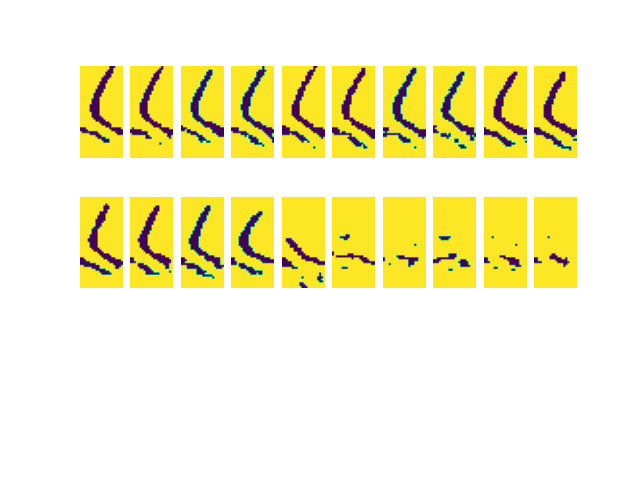
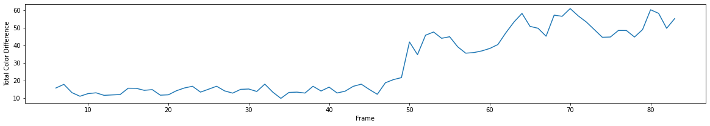

# TOD
Uses Worm_Yolov3 outputs to determine time of death in experiments.

## Process:
1. Detect worms with Worm-Yolov3
2. Using detections find the worms at the end of the experiment
3. Track those worms frame by frame in reverse
4. Image transformation on those bounding boxes
5. Image subtraction to determine if the worm has moved

## Image transformations to extract worm outline from Worm Yolov3 outputs.

## Using image subtraction on the averages between different frames we create a curve like bellow.

__Once the difference passes a certain threshold the worm is considered alive__

## How to use:
wip
